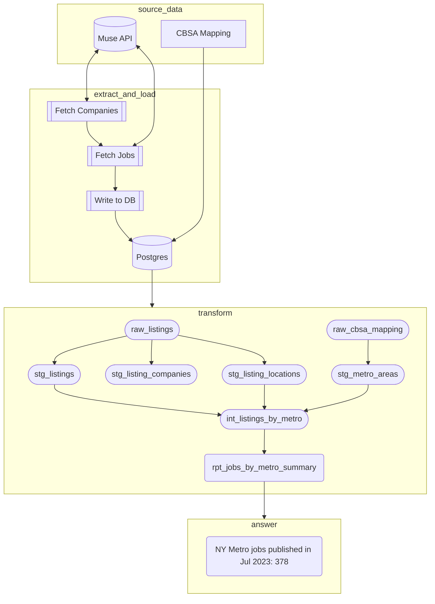

### Data Pipeline

```mermaid
flowchart TB
    subgraph source_data
        direction TB
        s1[(Muse API)]
        s2[CBSA Mapping]
    end

    subgraph extract_and_load
        direction TB
        e1[[Fetch Companies]]-->e2[[Fetch Jobs]]
        e2-->e3[[Write to DB]]
        e3-->e4[(Postgres)]
    end

    subgraph transform
        direction LR
        r1-->t3([stg_listings])
        r1([raw_listings])-->t1([stg_listing_companies])
        r1-->t2([stg_listing_locations])
        r2([raw_cbsa_mapping])-->t4([stg_metro_areas])
        t3-->i1([int_listings_by_metro])
        t2-->i1
        t4-->i1
        i1-->m1(rpt_jobs_by_metro_summary)
    end

    subgraph answer
        a(NY Metro jobs published in Jul 2023: 378)
    end

    s1<-->e1
    s1<-->e2
    s2-->e4
    e4-->transform
    m1-->answer
```
