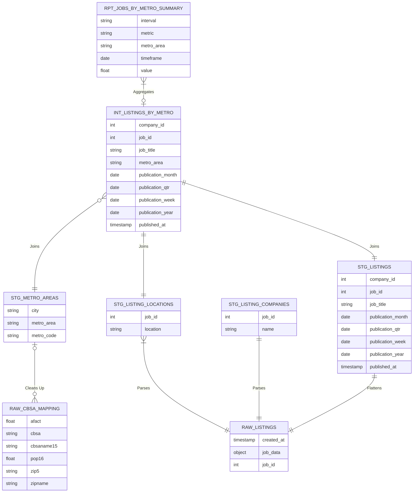

### Database Schema

```mermaid
erDiagram
    RAW_LISTINGS {
        timestamp created_at
        object job_data
        int job_id
    }
    RAW_CBSA_MAPPING {
        float afact
        string cbsa
        string cbsaname15
        float pop16
        string zip5
        string zipname
    }
    STG_LISTINGS {
        int company_id
        int job_id
        string job_title
        date publication_month
        date publication_qtr
        date publication_week
        date publication_year
        timestamp published_at
    }
    STG_LISTING_COMPANIES {
        int job_id
        string name
    }
    STG_LISTING_LOCATIONS {
        int job_id
        string location
    }
    STG_METRO_AREAS {
        string city
        string metro_area
        string metro_code
    }
    INT_LISTINGS_BY_METRO {
        int company_id
        int job_id
        string job_title
        string metro_area
        date publication_month
        date publication_qtr
        date publication_week
        date publication_year
        timestamp published_at
    }
    RPT_JOBS_BY_METRO_SUMMARY {
        string interval
        string metric
        string metro_area
        date timeframe
        float value
    }
    RPT_JOBS_BY_METRO_SUMMARY }|--|O INT_LISTINGS_BY_METRO : "Aggregates"
    INT_LISTINGS_BY_METRO }O--|| STG_METRO_AREAS : "Joins"
    INT_LISTINGS_BY_METRO ||--|| STG_LISTING_LOCATIONS : "Joins"
    INT_LISTINGS_BY_METRO ||--|| STG_LISTINGS : "Joins"
    STG_LISTING_LOCATIONS }|--|| RAW_LISTINGS : "Parses"
    STG_LISTING_COMPANIES ||--|| RAW_LISTINGS : "Parses"
    STG_LISTINGS ||--|| RAW_LISTINGS : "Flattens"
    STG_METRO_AREAS |O--O{ RAW_CBSA_MAPPING : "Cleans Up"
```
